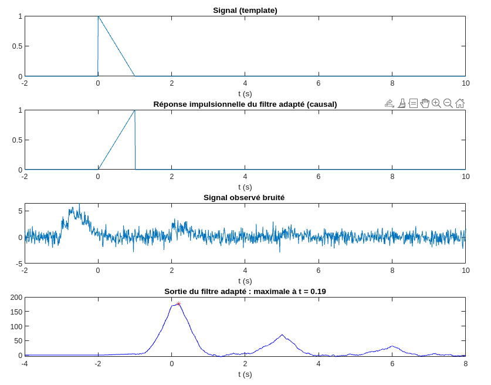

# **TP Traitement des Signaux Aléatoires**

<!-- markdownlint-disable MD033 -->

Ce répertoire contient les codes sources MATLAB des TPs de Traitement des Signaux Aléatoires au programme des 2ème année de Télécom Physique Strasbourg.
Consiste en l'analyse des signaux aléatoires sinusoïdaux et bruits.

## **TP1: Signaux aléatoires sinusoïdaux et bruits**

|||
|:---:|:---:|
|||

Prise en main de la génération de signaux aléatoires sinusoïdaux.

|||
|:---:|:---:|

## **TP2: Détection de signaux noyés dans du bruit**

### ***Bruitage d'un signal sinusoïdal***

Signal sinusoïdal de fréquence bruité par un bruit blanc.

Pour différente valeurs de Rapport Signal Bruit (signal plus ou moins bruité).

### ***Méthode de détection d'un signal dans du bruit***

Methode de détection d'un signal plongé dans du bruit grâce à l'intercorrélation avec un signal de référence de même fréquence.

Méthode de balayage de fréquence pour trouver la fréquence du signal plongé dans le bruit.

### ***Sur des signaux inconnus***

Pratique sur des bruits générés inconnus: on retrouve leur fréquence grâce à la méthode de balayage de fréquence.
Pour des sinusoïdes complexes, on retrouve la fréquence de chaque harmonique.

## **TP3: Filtrage adapté**

### **Détection d'un signal déterministe connu**

Le dernier signal est un signal dans lequel on cherche à détecter trois signaux déterministes connus. On remarque que la sortie du filtre adapté donne trois maximums locaux, correspondant aux trois temps d'apparition des signaux déterministes.

### **Application à la détection de la raie d’émission Lyα de l’hydrogène dans le spectre d’une galaxie lointaine**

La détection de galaxies lointaines est l’une des tâches pour lequel l’instrument MUSE (Multi Unit Spectroscopic Explorer) a été conçu. Il produit des images hyperspectrales, c’est à dire des images en trois dimensions : deux dimensions spatiales correspondant à la portion de ciel observée et une dimension spectrale : à chaque pixel de l’image 2D, un spectre est associé. Les galaxies lointaines sont difficiles à observer, elles sont spatialement peu étendues du fait de leur distance et leur spectre est composé d’une seule raie d’émission, la raie Lyα de l’hydrogène, dont la position est inconnue et dépend de la distance (elle aussi inconnue) de la galaxie. Les spectres de ces galaxies présentent un rapport signal à bruit très faible. Les données MUSE ont une résolution spatiale de 0,25 arcsecondes et une résolution spectrale de 0,125 nm. Le spectre s’étend entre 475 nm et 930 nm.

Peut-on assimiler ces spectres à des bruits blancs ? Voici l'intercorrélation de deux spectres de deux pixels différents:

On remarque que l'intercorrélation est quasi-nulle (dû au fait que l'on calcule sur des plages finies), donc les spectres sont non corrélés. On peut donc assimiler ces spectres à des bruits blancs.

### **Détection de la raie Lyα**

Le centre de la galaxie a été détecté dans le pixel de coordonnées (9, 8). Nous allons essayer de détecter automatiquement la position de la raie Lyα dans le spectre de la galaxie afin de déterminer l’âge de la galaxie. Pour cela nous utiliserons le gabarit de la raie Lyα et la méthode du filtrage adapté.
