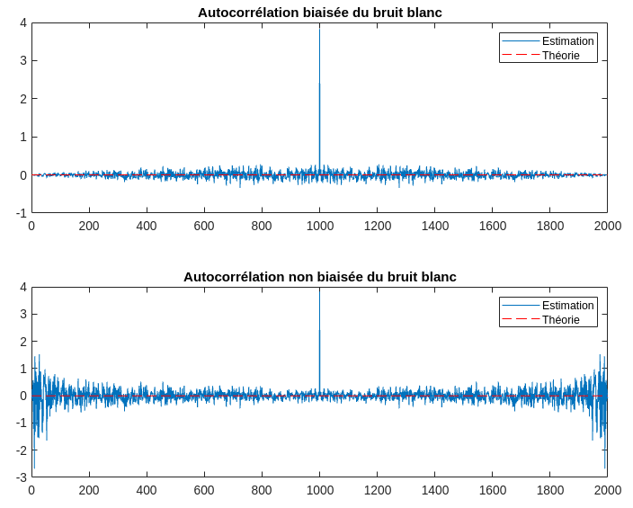

# **TP Traitement des Signaux Aléatoires**

<!-- markdownlint-disable MD033 -->

Ce répertoire contient les codes sources MATLAB des TPs de Traitement des Signaux Aléatoires au programme des 2ème année de Télécom Physique Strasbourg.
Consiste en l'analyse des signaux aléatoires sinusoïdaux et bruits.

## **TP1: Signaux aléatoires sinusoïdaux et bruits**

|||
|:---:|:---:|
|||

|||
|:---:|:---:|
|||

## **TP2: _A suivre..._**
